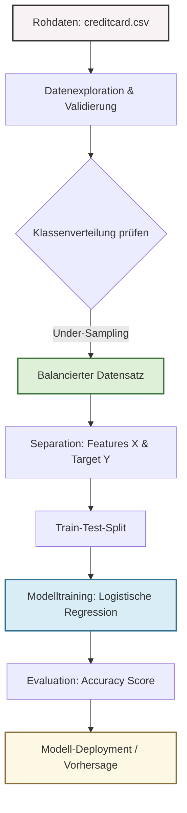

# Kreditkarten-Betrugserkennung

## Einführung
Die Erkennung von Kreditkartenbetrug ist eine der kritischsten Herausforderungen im modernen Finanzsektor, bei der es darum geht, illegitime Transaktionen schnell zu identifizieren und so Kunden sowie Banken vor finanziellen Verlusten zu schützen. Dieses Projekt nutzt maschinelle Lernverfahren, um komplexe Muster in Transaktionsdaten zu erkennen und betrügerische Aktivitäten von legitimen Käufen zu unterscheiden. Eine besondere Herausforderung stellt dabei die stark unausgewogene Verteilung der Daten dar, da Betrugsfälle in der Praxis nur einen winzigen Bruchteil aller Transaktionen ausmachen. Durch den gezielten Einsatz von Under-Sampling-Techniken und einer Logistischen Regression wird ein robustes Klassifikationsmodell entwickelt. Ziel ist es, ein präzises und effizientes System bereitzustellen, das als fundierte Grundlage für weiterführende Betrugserkennungssysteme in der Finanztechnologie dient.


## Projektbeschreibung
Dieses Projekt zielt darauf ab, betrügerische Kreditkartentransaktionen mithilfe von maschinellem Lernen zu identifizieren. Da der Datensatz hochgradig ungleichgewichtig ist (viel mehr legitime als betrügerische Transaktionen), wird ein **Under-Sampling**-Verfahren angewendet, um ein ausgeglichenes Trainingsset zu erstellen.

## Architektur & Pipeline
Das folgende Diagramm illustriert den gesamten Arbeitsablauf (die Pipeline) des Machine-Learning-Projekts, von den Rohdaten bis zur finalen Evaluation:



## Datensatz
Der verwendete Datensatz enthält Transaktionen von europäischen Karteninhabern. 
- **Legitime Transaktionen (0)**: Überwiegende Mehrheit
- **Betrügerische Transaktionen (1)**: Stark unterrepräsentiert
- **Features**: Zeit, Betrag und 28 anonymisierte V-Features (PCA-transformiert).

## Arbeitsablauf
1. **Datenimport**: Laden der Abhängigkeiten (`pandas`, `numpy`, `scikit-learn`).
2. **Datenexploration**: Analyse der Verteilung von legitimen und betrügerischen Transaktionen.
3. **Datenvorverarbeitung**: 
    - Behandlung von fehlenden Werten.
    - Erstellung eines Sub-Samples der legitimen Daten, um sie an die Anzahl der Betrugsfälle (338) anzupassen.
4. **Datenaufteilung**: Splitten der Daten in Features (X) und Zielvariable (Y) sowie in Trainings- und Testsets.
5. **Modelltraining**: Einsatz einer **Logistischen Regression**.
6. **Evaluierung**: Messung der Genauigkeit (Accuracy Score) für Trainings- und Testdaten.

## Ergebnisse
Das Modell erzielt folgende Genauigkeitswerte:
- **Genauigkeit bei Trainingsdaten**: ca. 93,8%
- **Genauigkeit bei Testdaten**: ca. 95,5%

## Voraussetzungen
Um dieses Notebook auszuführen, werden folgende Python-Bibliotheken benötigt:
```python
import numpy
import pandas
import sklearn
```
